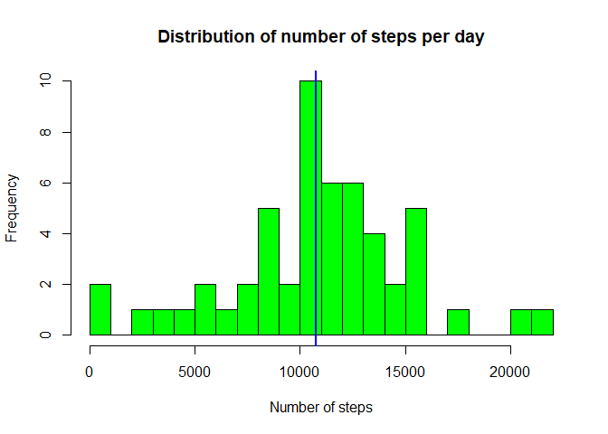
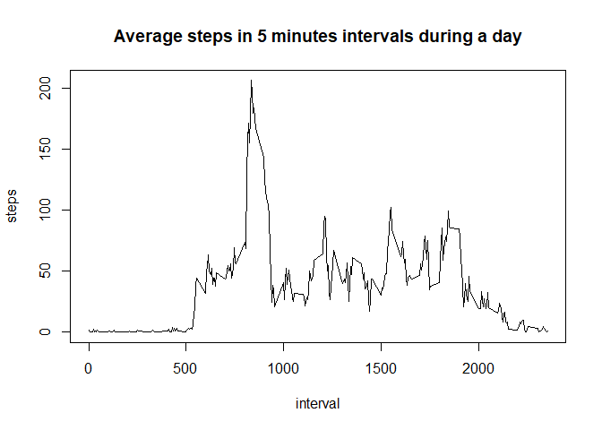
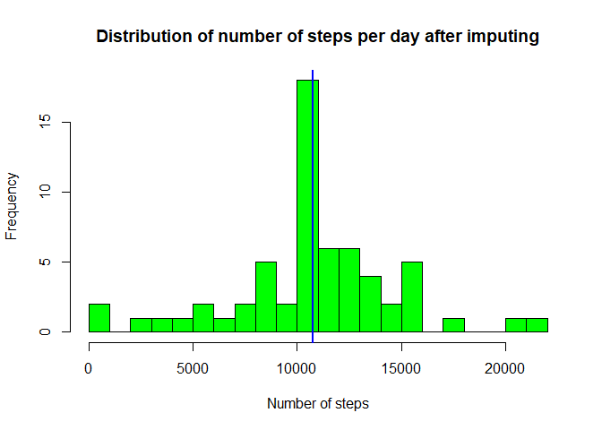
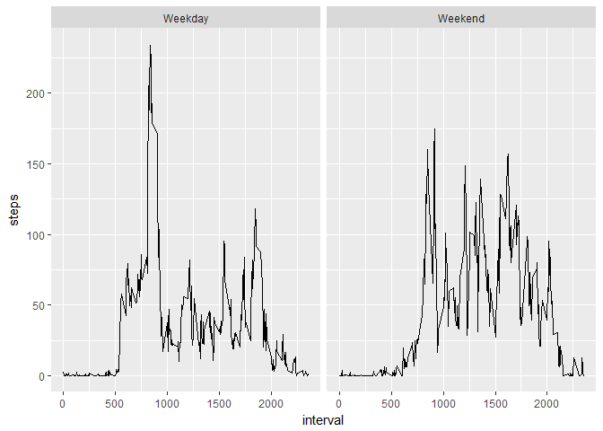

# Reproducible Research: Peer Assessment 1


## Loading and preprocessing the data
The following R code performs the loading and preprocessing of data:

```r
if(!file.exists("activity.csv")){
  fileURL="https://d396qusza40orc.cloudfront.net/repdata%2Fdata%2Factivity.zip"
  download.file(fileURL,destfile = "repdata_data_activity.zip")
  unzip("repdata_data_activity.zip")
}
activity<-read.csv("activity.csv")
```


## What is mean total number of steps taken per day?
The below histogram provides the distribution of total number of steps per day. The mean and median for this is marked.

```r
library(dplyr)
```

```
## Warning: package 'dplyr' was built under R version 3.3.3
```

```
## 
## Attaching package: 'dplyr'
```

```
## The following objects are masked from 'package:stats':
## 
##     filter, lag
```

```
## The following objects are masked from 'package:base':
## 
##     intersect, setdiff, setequal, union
```

```r
groupdf<-group_by(activity,date)
stepsperday<-summarise(groupdf,steps=sum(steps))
hist(stepsperday$steps,main="Distribution of number of steps per day",breaks=25,xlab="Number of steps",col="green")
abline(v=mean(stepsperday$steps,na.rm=TRUE),col="red",lwd=2)
abline(v=median(stepsperday$steps,na.rm=TRUE),col="blue",lwd=2)
```

<!-- -->

The mean of total number of steps per day is:

```r
mean(stepsperday$steps,na.rm=TRUE)
```

```
## [1] 10766.19
```

The median is:

```r
median(stepsperday$steps,na.rm=TRUE)
```

```
## [1] 10765
```
## What is the average daily activity pattern?
Below is a time series plot of the 5-minute intervals and the average number of steps taken, averaged across all days:


```r
groupdf<-group_by(activity,interval)
stepsperinterval<-summarise(groupdf,steps=mean(steps,na.rm=TRUE))
with(stepsperinterval,plot(interval,steps,type="l",main="Average steps in 5 minutes intervals during a day"))
```

<!-- -->

The interval with maximum average number of steps is:

```r
stepsperinterval$interval[which(stepsperinterval$steps==max(stepsperinterval$steps))]
```

```
## [1] 835
```

## Imputing missing values

The total number of records with missing values for steps is:

```r
sum(is.na(activity$steps))
```

```
## [1] 2304
```
This represents following percentage of records:

```r
paste(as.character(signif(mean(is.na(activity$steps))*100),2),"%")
```

```
## [1] "13.1148 %"
```

For missing steps data, data will be filled in with average number of steps  corresponding to an interval.

```r
mergeddata<-merge(activity,stepsperinterval,by="interval")
mergeddata$steps.x[is.na(mergeddata$steps.x)]<-mergeddata$steps.y[is.na(mergeddata$steps.x)]
groupdf<-group_by(mergeddata,date)
stepsperday<-summarise(groupdf,steps=sum(steps.x))
hist(stepsperday$steps,main="Distribution of number of steps per day after imputing",breaks=25,xlab="Number of steps",col="green")
abline(v=mean(stepsperday$steps,na.rm=TRUE),col="red",lwd=2)
abline(v=median(stepsperday$steps,na.rm=TRUE),col="blue",lwd=2)
```

<!-- -->

The mean of total number of steps per day after imputing is:

```r
mean(stepsperday$steps,na.rm=TRUE)
```

```
## [1] 10766.19
```

The median after imputing is:

```r
median(stepsperday$steps,na.rm=TRUE)
```

```
## [1] 10766.19
```

The mean value did not change after imputing data. The median changed by 1.19 steps.

## Are there differences in activity patterns between weekdays and weekends?
The two timeseries charts below shows diferences in average steps during intervals on weekdays and weekends.


```r
activity_new<-activity
activity_new$date<-as.Date(as.character(activity_new$date))
activity_new$day<-weekdays(activity_new$date)
activity_new$daytype[activity_new$day== "Saturday" | activity_new$day == "Sunday"]<-"Weekend"
activity_new$daytype[activity_new$day!= "Saturday" & activity_new$day != "Sunday"]<-"Weekday"
groupdf<-group_by(activity_new,interval,daytype)
stepsperinterval<-summarise(groupdf,steps=mean(steps,na.rm=TRUE))
library(ggplot2)
```

```
## Warning: package 'ggplot2' was built under R version 3.3.3
```

```r
g<-ggplot(stepsperinterval,aes(interval,steps))
g +geom_line() + facet_grid(.~stepsperinterval$daytype)
```

<!-- -->
